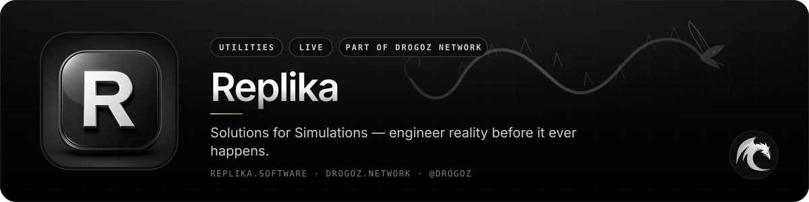
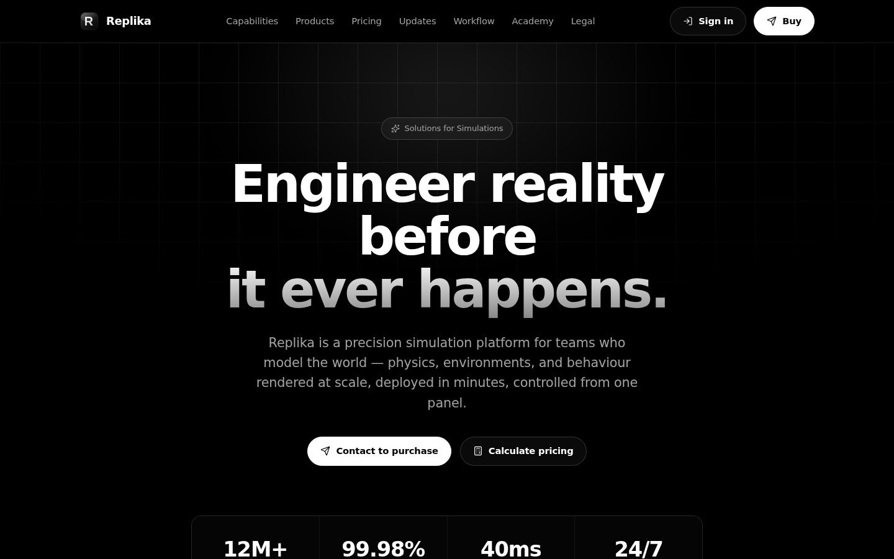
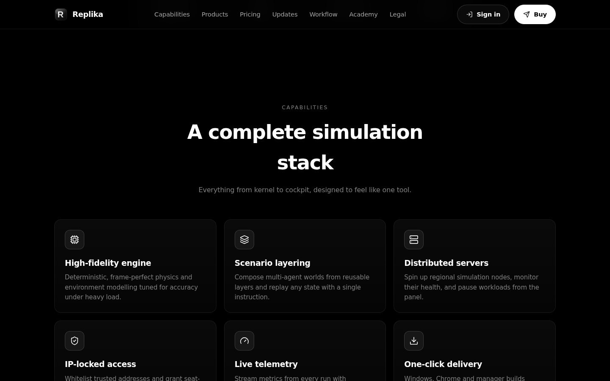
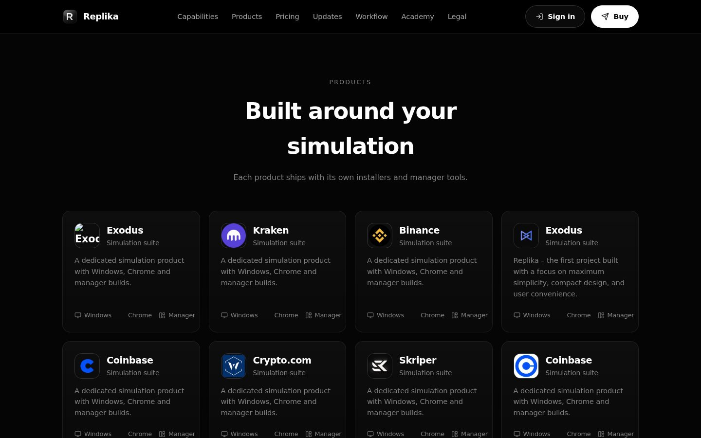
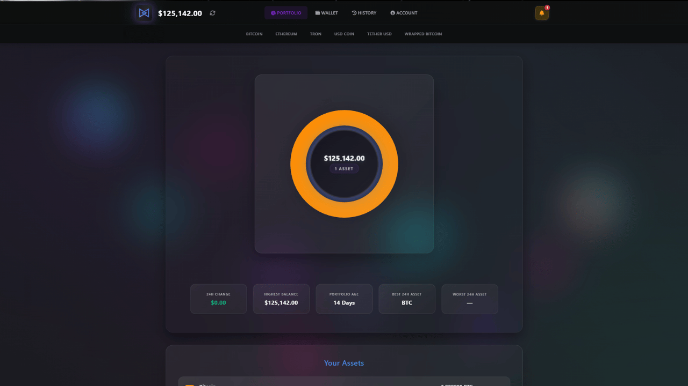
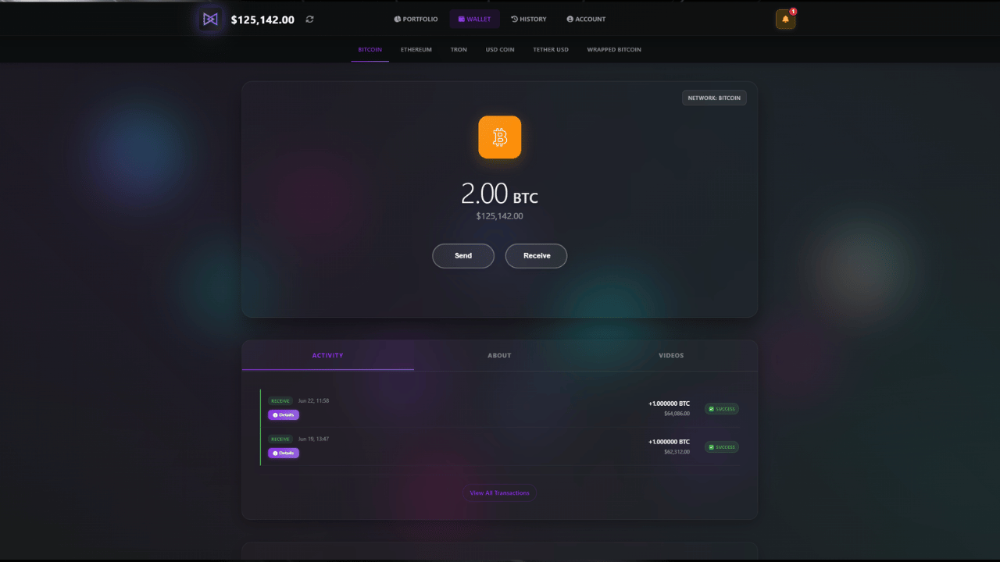
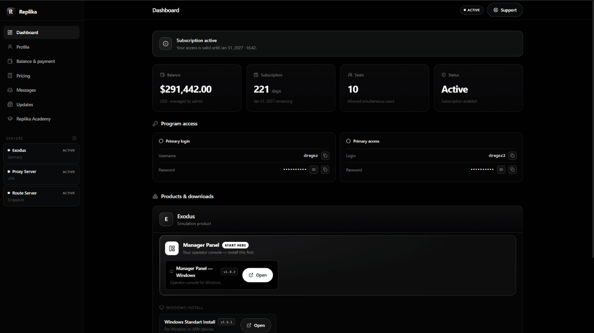
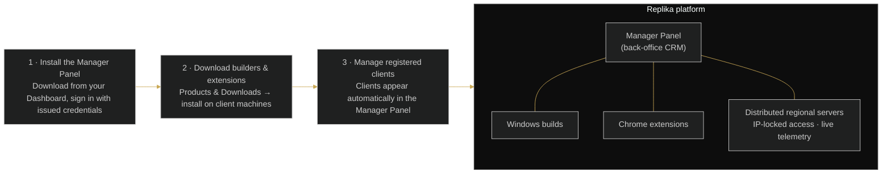

 

# Replika

### Solutions for Simulations — engineer reality before it ever happens.

 

  

 

## 📋 Table of contents

- [Overview](#-overview)
- [Key features](#-key-features)
- [Screenshots](#-screenshots)
- [How it works](#%EF%B8%8F-how-it-works)
- [Use cases](#-use-cases)
- [Pricing](#-pricing)
- [Free live demonstration](#-free-live-demonstration)
- [Links](#-links)

## 🧭 Overview

Replika is a precision simulation platform for teams who model the world — physics, environments and behaviour rendered at scale, deployed in minutes and controlled from one panel. Every product ships with its own installers (Windows, Chrome and manager builds) delivered straight to your dashboard the moment they ship.

The platform is designed for users who need to display unlimited balances to clients without quantity restrictions. Agents can independently manage balances, communicate with clients and handle operations through a centralized system, while advanced browser extensions and supporting tools make the workflow significantly easier, more efficient and more convincing for end users.

Built for reliability, scalability and high-volume operations, Replika combines a deterministic high-fidelity engine, distributed regional servers, IP-locked seat-based access and live telemetry — plus the Replika Academy with step-by-step guides, video walkthroughs and reference articles inside your dashboard.

<table>
<tr>
<td align="center" width="25%"><b>Category</b> Utilities</td>
<td align="center" width="25%"><b>Status</b> Live</td>
<td align="center" width="25%"><b>Bundle</b> Utilities (−2%)</td>
<td align="center" width="25%"><b>Pricing</b> Sign in to see pricing</td>
</tr>
</table>

## ✨ Key features

### 🎛️ Control & operations

- **Full Back-Office CRM Control** — manage every registered client from the Manager Panel.
- **Unlimited Cryptocurrency Balance Display** — display balances to clients without quantity restrictions.
- **Dedicated Support Chat for Specific Wallets** — communicate with clients through the centralized system.
- **Wallet Address Replacement** and **Manual Transaction Editing**.
- **IP Restrictions for Users** — whitelist trusted addresses and grant seat-based permissions per account, centrally enforced.

### 📦 Delivery

- **APK and .EXE Installation Packages** — Windows, Chrome and manager builds for every product.
- **Fresh Download Links** — one-click delivery of the latest verified version straight to your dashboard.
- **Simulation suites** — Exodus, Kraken, Binance, Coinbase, Crypto.com, Skriper, and a dedicated-server package with separate user accounts.

### ⚙️ Simulation stack

- **High-fidelity engine** — deterministic, frame-perfect physics and environment modelling tuned for accuracy under heavy load.
- **Scenario layering** — compose multi-agent worlds from reusable layers and replay any state with a single instruction.
- **Distributed servers** — spin up regional simulation nodes, monitor their health and pause workloads from the panel.
- **Live telemetry** — stream metrics from every run with millisecond resolution and exportable timelines.

### 🎓 Learning & support

- **Replika Academy** — step-by-step guides, video walkthroughs and reference articles inside your dashboard.
- **Platform figures** — 12M+ simulated runs · 99.98% uptime · 40 ms avg. step time · 24/7 operations.

## 🖼️ Screenshots

> Product images from [replika.software](https://replika.software/) and the [service page](https://drogoz.network/services/replika/) on drogoz.network.

<table>
<tr>
<td width="50%" align="center"> Replika — Engineer reality before it ever happens</td>
<td width="50%" align="center"> Replika — A complete simulation stack</td>
</tr>
<tr>
<td width="50%" align="center"> Replika — Products built around your simulation</td>
<td width="50%" align="center"> Replika — product interface</td>
</tr>
<tr>
<td width="50%" align="center"> Replika — product interface</td>
<td width="50%" align="center"> Replika — product interface</td>
</tr>
</table>

## ⚙️ How it works

**From sign-in to simulation**

## 🎯 Use cases

<table>
<tr>
<td width="50%" valign="top"><b>🏢 Multi-agent offices</b> Agents independently manage balances and client communication through one centralized system.</td>
<td width="50%" valign="top"><b>🖥️ Desktop + browser deployments</b> Windows and Chrome builds with a manager panel, delivered the moment they ship.</td>
</tr>
<tr>
<td width="50%" valign="top"><b>🌍 Distributed teams</b> Regional simulation nodes with IP-locked, seat-based access enforced centrally.</td>
<td width="50%" valign="top"><b>📊 Telemetry-driven operations</b> Millisecond-resolution metrics and exportable timelines for every run.</td>
</tr>
</table>

## 💳 Pricing

> **Sign in at [drogoz.network](https://drogoz.network/accounts/login/) to see pricing.** Billed per user · Min. 50 users.

Replika is part of the **Utilities** bundle (−2%) — *Core utility tools* — and of **All In One** (−10%) — *Every product, best price*. Take several products together and save more: [Packages & bundles](https://drogoz.network/#packages) · [Pricing & calculator](https://drogoz.network/pricing/).

| Bundle | Discount | Included |
|---|---|---|
| **Utilities** | −2% | Drog AI, MyMask AI, Replika, IMPERATORI, RiderSwap, Vadira, Skriper |
| **All In One** | −10% | Drog AI, MyMask AI, Replika, Lidaro AI, IMPERATORI, ZOI Talks, RiderSwap, HyperBlast AI, VerifHub AI, Vadira, Skriper |

## 🎥 Free live demonstration

**A live demonstration is 100% free on every product.** 
See Replika in action before you pay — our agent gets in touch and walks you through a live demonstration.

Registration is handled by our team — get in touch and receive personal access.

## 🔗 Links

| Channel | Link |
|---|---|
| 🌐 **Website** | [replika.software](https://replika.software/) |
| 📄 **Details page** | [drogoz.network/services/replika/](https://drogoz.network/services/replika/) |
| ✈️ **Telegram group** | [@replika_pro](https://t.me/replika_pro) |
| 🏛️ **Drogoz Network** | [drogoz.network](https://drogoz.network) · [Services](https://drogoz.network/#services) · [Packages](https://drogoz.network/#packages) · [Pricing](https://drogoz.network/pricing/) · [Presentation](https://drogoz.network/presentation/) |
| ⚖️ **Legal** | [Terms of Service](https://drogoz.network/legal/terms-of-service/) · [Acceptable Use](https://drogoz.network/legal/acceptable-use-policy/) · [Privacy](https://drogoz.network/legal/privacy-policy/) · [Refunds](https://drogoz.network/legal/refund-policy/) · [Disclaimer](https://drogoz.network/legal/disclaimer/) · [Compliance](https://drogoz.network/legal/compliance-policy/) |
| 🐙 **GitHub** | [deepdrogo](https://github.com/deepdrogo/deepdrogo) |

 

   
  
    
  <b>Made by <a href="https://drogoz.network">Drogoz Network</a></b> 
  One network — all your services · Premium SaaS Network
    
  
  
  
  
    
  <b>More from the network:</b> <a href="https://github.com/deepdrogo/drog-ai">Drog AI</a> · <a href="https://github.com/deepdrogo/mymask-ai">MyMask AI</a> · <a href="https://github.com/deepdrogo/lidaro-ai">Lidaro AI</a> · <a href="https://github.com/deepdrogo/imperatori">IMPERATORI</a> · <a href="https://github.com/deepdrogo/zoi-talks">ZOI Talks</a> · <a href="https://github.com/deepdrogo/riderswap-io">RiderSwap</a> · <a href="https://github.com/deepdrogo/hyperblast-ai">HyperBlast AI</a> · <a href="https://github.com/deepdrogo/verifhub-ai">VerifHub AI</a> · <a href="https://github.com/deepdrogo/vadira-net">Vadira</a> · <a href="https://github.com/deepdrogo/skriper-io">Skriper</a> · <a href="https://github.com/deepdrogo/mytasker">MyTasker</a> · <a href="https://github.com/deepdrogo/mamont-tech">Mamont</a>
    
  © 2026 Drogoz Network. All rights reserved. Provided strictly for lawful use — see the <a href="https://drogoz.network/legal/">Legal Center</a>. Each user is solely responsible for how they use the software.

